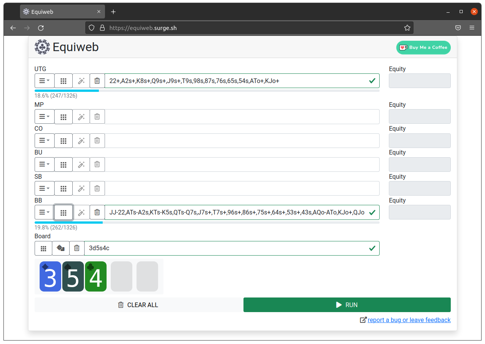
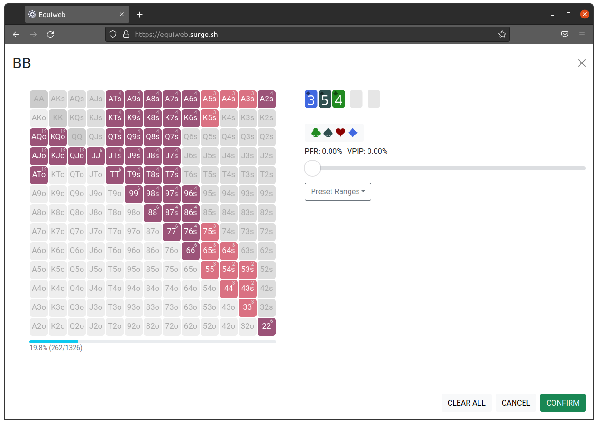

# Equiweb

> Run range vs. range hold'em equity simulations anywhere, anytime - for free!

Just go to the [web app](https://equiweb.surge.sh/) and start entering some ranges.

## Features

- Range vs. range hold'em equity simulations
- Up to 6 players
- Free, no registration
- Runs on every platform in the browser
- Mobile support - use it anywhere where you have internet access
- Share via URL - common forum format support
- Open-source software

## Screenshots

## Other Poker Software

* [Randomizer/RNG](https://github.com/battermann/randomizer)